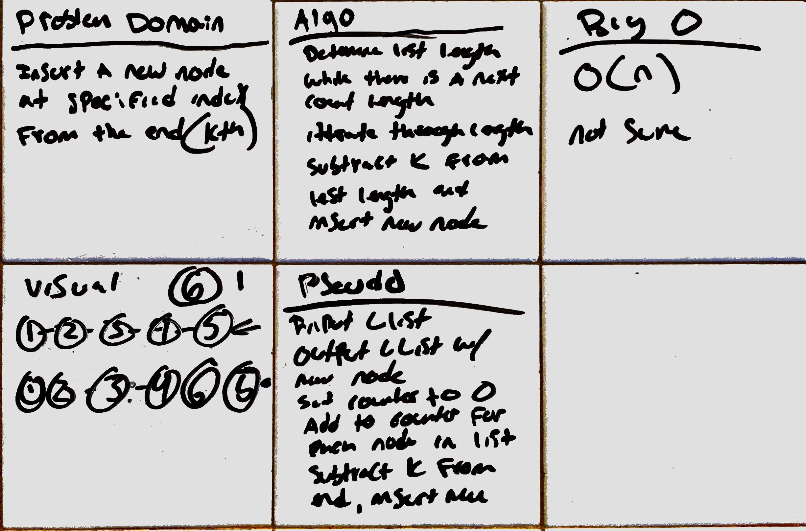
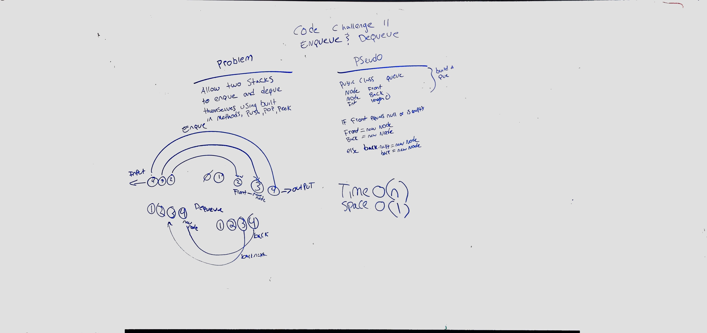
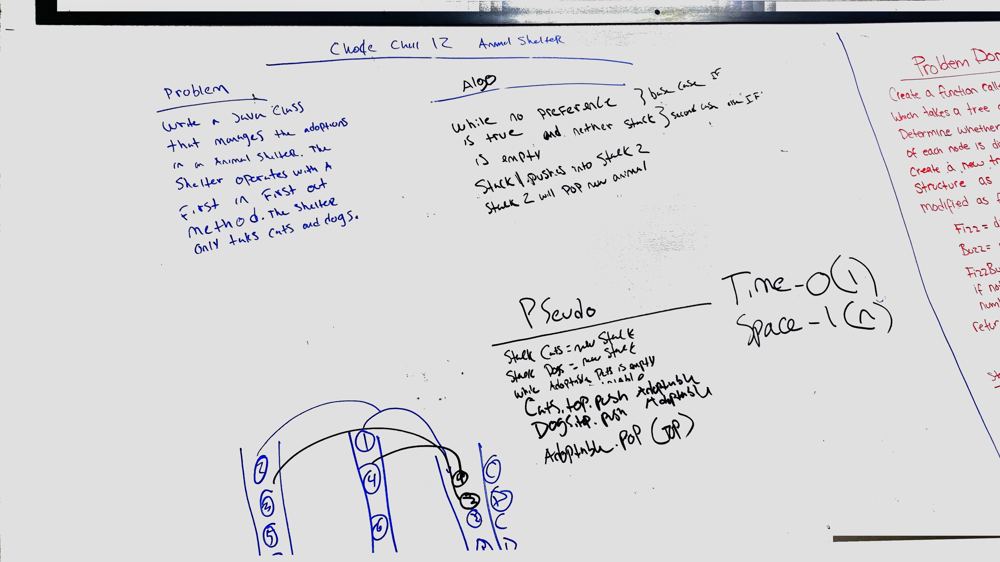
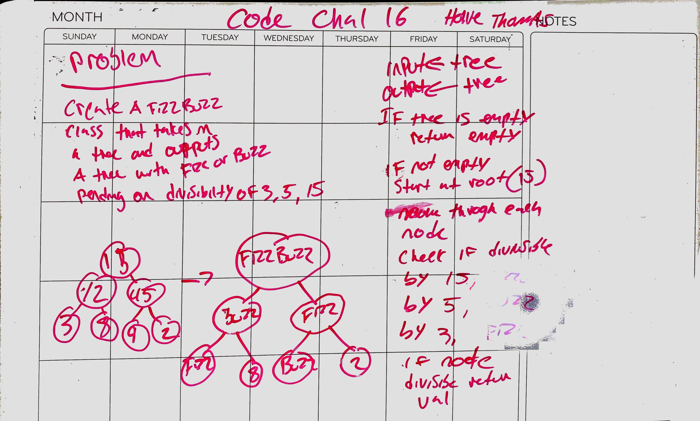
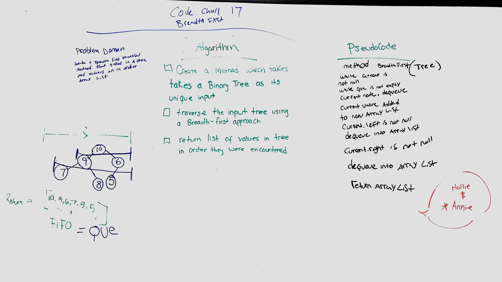
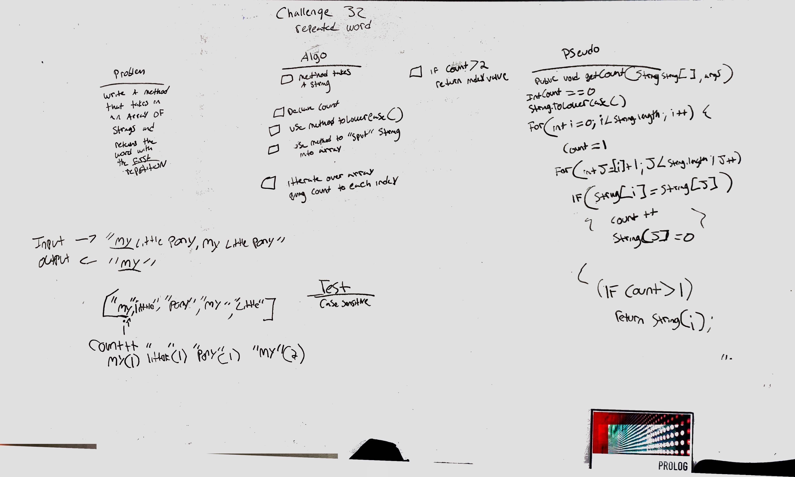

# data-structures-and-algorithms 401

## Reverse an Array
### Challenge
write a method to reverse an array

### Approach & Efficiency
My partner and I took the nested for-loop approach. I belive there is probably a more efficent method, but we went this way because we know it would work

### Solution

## Shift an Array
### Challenge
write a method to add an elment into an array of integers

### Approach & Efficiency
My partner and I took the approach of dividing the array by length to determine the middle and insert the new element

### Solution

## Binary Search an Array
### Challenge
write a method to binary search an array

### Approach & Efficiency
My partner and I took the approach of dividing the array by its length and repeating until the the search number was found

### Solution

## Insert Node at Kth
### Challenge
write a method to insert a node in the "kth" position from the end of a linked list

### Approach & Efficiency
I took the approach of determining the length of the node, using a counter, and inserting the new node at the end minus the given number. 

### Solution

#Code Challenge 11
## Enqueue and Dequeue

### Challenge
Create two methods :Enqueue(value) which inserts value into the PseudoQueue, using a first-in, first-out approach.
Dequeue() which extracts a value from the PseudoQueue, using a first-in, first-out approach.
The Stack instances have only push, pop, and peek methods. You should use your own Stack implementation. Instantiate these Stack objects in your PseudoQueue constructor

### Resources
* [Java Queue](https://www.geeksforgeeks.org/queue-interface-java/)

### Approach and Efficiency
* Approach: Write the most efficent method for eneque and dequeue

### Solution

#Code Challenge 12
## Animal Shelter

### Challenge
Create a class called AnimalShelter which holds only dogs and cats. The shelter operates using a first-in, first-out approach.
Implement the following methods:
enqueue(animal): adds animal to the shelter. animal can be either a dog or a cat object.
dequeue(pref): returns either a dog or a cat. If pref is not "dog" or "cat" then return null.

### Approach and Efficiency
* Approach: Write the most efficent method for a stack que

### Solution

#Code Challenge 13
## Bracket Validation

### Challenge
Your function should take a string as its only argument, and should return a boolean representing whether or not the brackets in the string are balanced. There are 3 types of brackets:

Round Brackets : ()
Square Brackets : []
Curly Brackets : {}

### Approach and Efficiency
* use hashsets and a hashmap for opening and closing brackets. Traverse the string and if char is opening, move it the top of the stack, if char is closing look for the opening;

### Solution

#Code Challenge 15
## Tree and Binary Search Tree

### Challenge
Create a class `Tree` which has `preOrder()`, `inOrder()`, and `postOrder()` traversal methods.

Create a class `BinarySearchTree` which has `add(int value)` and `contains(int value)` methods.

### Resources
* [Binary Tree](https://www.baeldung.com/java-binary-tree)
* [Comparing Generic Types](https://stackoverflow.com/questions/20793082/java-comparing-generic-types)

#Code Challenge 16
## Fizz Buzz 

### Challenge
Write a recursive traversal of a tree that returns Fizz if the value is divisible by 3, Buzz if divisibile by 5, and FizzBuss if divisible by 15

### Approach and Efficiency
* Approach: Write the most efficent method for a breadth first traversal

### Solution

#Code Challenge 17
## Breadth First

### Challenge
Write a breadth first traversal method which takes a Binary Tree as its unique input. Without utilizing any of the built-in methods available to your language, traverse the input tree using a Breadth-first approach, and return a list of the values in the tree in the order they were encountered.

### Approach and Efficiency
* Approach: Write the most efficent method for a breadth first traversal

### Solution

#Code Challenge 18
## Find MaxVal

### Challenge
Write an instance method called find-maximum-value. Without utilizing any of the built-in methods available to your language, return the maximum value stored in the tree. You can assume that the values stored in the Binary Tree will be numeric.

### Approach and Efficiency
* Approach: Write the most efficent method for a breadth first traversal

### Solution

# Hashtables

## Challenge
add: takes in both the key and value. This method should hash the key, and add the key and value pair to the table, handling collisions as needed.
get: takes in the key and returns the value from the table.
contains: takes in the key and returns a boolean, indicating if the key exists in the table already.
hash: takes in an arbitrary key and returns an index in the collection.

## Approach & Efficiency
Hashtables are an O(1) approach

## API

- [x] Get
- [x] Add
- [x] Hash
- [x] Contains

# Repeated Words (Challenge 32) 

## Challenge
**Write a function that accepts a lengthy string parameter.
Without utilizing any of the built-in library methods available to your language, return the first word to occur more than once in that provided string.**

## Approach & Efficiency
The Time complexity will be O(n)

### Solution

## Challenge 33

**Without utilizing any of the built-in library methods available to your language, return a set of values found in both trees.**

## Approach & Efficiency
The Time complexity will be O(N)

# Graphs

## Challenge
**AddNode()**
Adds a new node to the graph
Takes in the value of that node
Returns the added node

**AddEdge()**
Adds a new edge between two nodes in the graph
Include the ability to have a “weight”
Takes in the two nodes to be connected by the edge
Both nodes should already be in the Graph

**GetNodes()**
Returns all of the nodes in the graph as a collection (set, list, or similar)

**GetNeighbors()**
Returns a collection of nodes connected to the given node
Takes in a given node
Include the weight of the connection in the returned collection

**Size()**
Returns the total number of nodes in the graph

## Approach & Efficiency
The Time complexity will be O(V + E), where V is the number of vertices, and E is the number of Edges.

# Tree intersection

## Challenge 33

**Without utilizing any of the built-in library methods available to your language, return a set of values found in both trees.**

## Approach & Efficiency
The Time complexity will be O(N)
