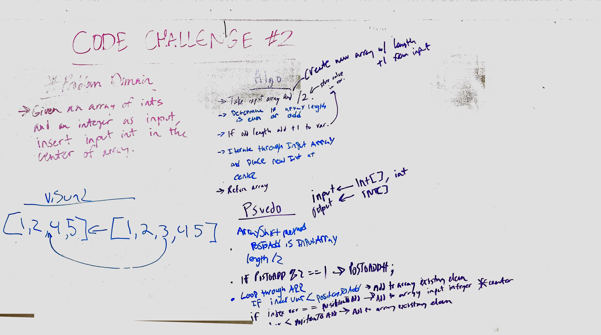
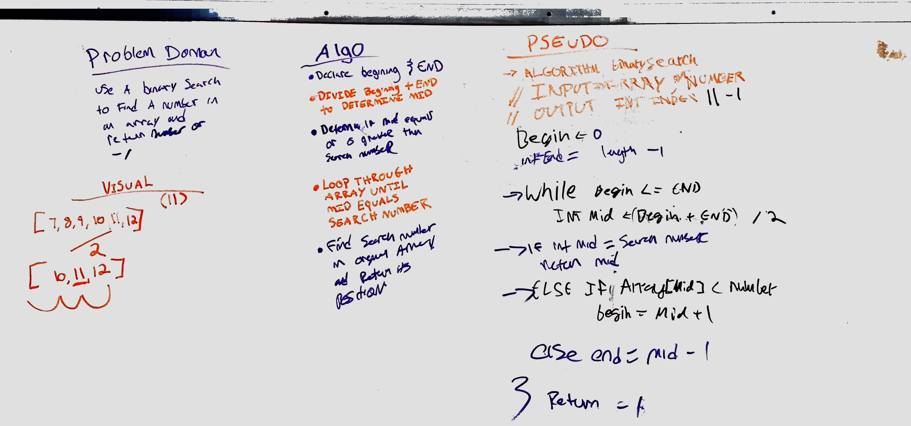

# data-structures-and-algorithms 401

## Reverse an Array
### Challenge
write a method to reverse an array

### Approach & Efficiency
My partner and I took the nested for-loop approach. I belive there is probably a more efficent method, but we went this way because we know it would work

### Solution

## Shift an Array
### Challenge
write a method to add an elment into an array of integers

### Approach & Efficiency
My partner and I took the approach of dividing the array by length to determine the middle and insert the new element

### Solution

## Binary Search an Array
### Challenge
write a method to binary search an array

### Approach & Efficiency
My partner and I took the approach of dividing the array by its length and repeating until the the search number was found

### Solution
