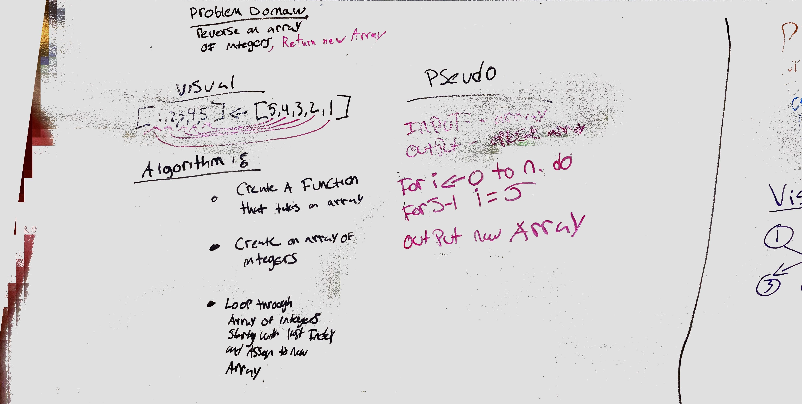

# data-structures-and-algorithms 401

## Reverse an Array
### Challenge
write a method to reverse an array

### Approach & Efficiency
My partner and I took the nested for-loop approach. I belive there is probably a more efficent method, but we went this way because we know it would work

### Solution

## Shift an Array
### Challenge
write a method to add an elment into an array of integers

### Approach & Efficiency
My partner and I took the approach of dividing the array by length to determine the middle and insert the new element

### Solution

## Binary Search an Array
### Challenge
write a method to binary search an array

### Approach & Efficiency
My partner and I took the approach of dividing the array by its length and repeating until the the search number was found

### Solution

## Insert Node at Kth
### Challenge
write a method to insert a node in the "kth" position from the end of a linked list

### Approach & Efficiency
I took the approach of determining the length of the node, using a counter, and inserting the new node at the end minus the given number. 

### Solution

#Code Challenge 15
## Tree and Binary Search Tree

### Challenge
Create a class `Tree` which has `preOrder()`, `inOrder()`, and `postOrder()` traversal methods.

Create a class `BinarySearchTree` which has `add(int value)` and `contains(int value)` methods.

### Resources
* [Binary Tree](https://www.baeldung.com/java-binary-tree)
* [Comparing Generic Types](https://stackoverflow.com/questions/20793082/java-comparing-generic-types)

### Approach and Efficiency
* Approach: Create a test driven Class which follows best practices and has optimized time and space.

    
