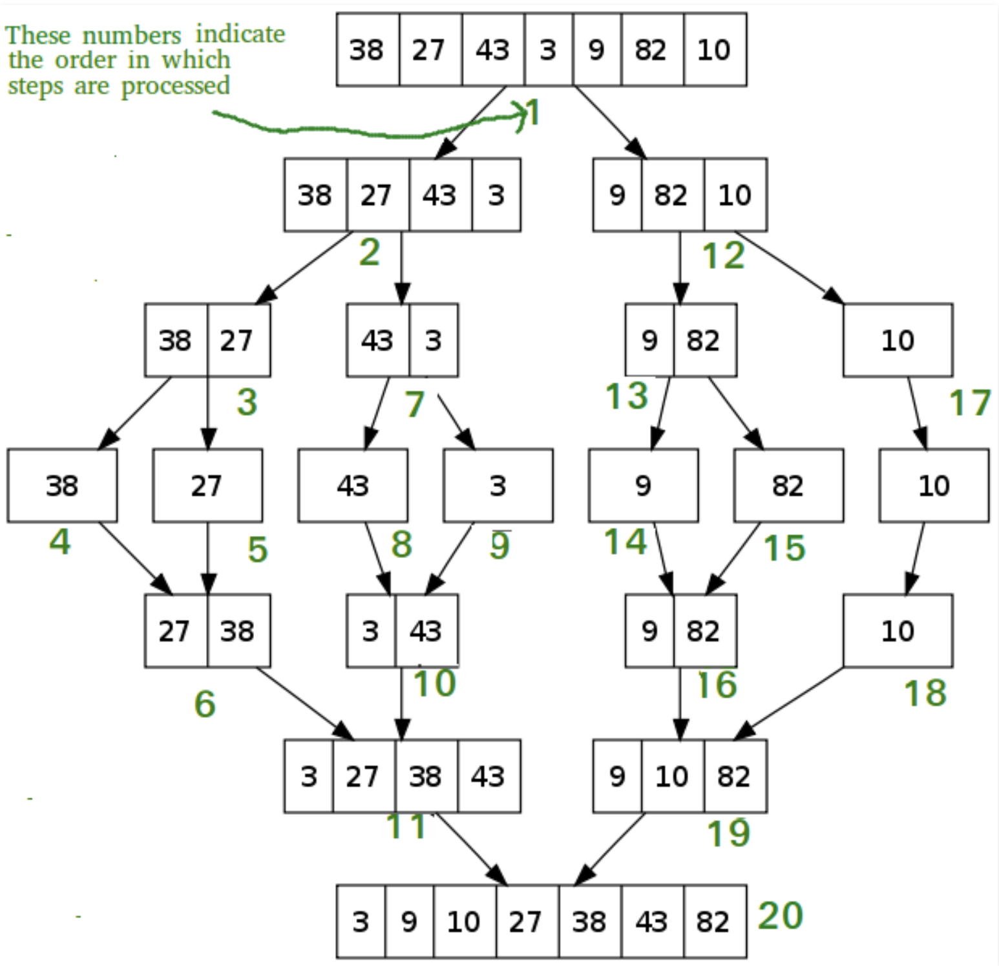

# data-structures-and-algorithms Blogs

## Insertion Sort  walk through 
#### Authors: Annie Pineda and Hollie Thomas
### Challenge
Diagram a walk-through of what happens when the method Insertion Sort is applied to a given array of integers.  

### Approach & Efficiency
The given approach is not the most efficent for sorting an array with a time of (N^2) and space O(1)

### Solution
The method passes through the array until the array is arranged in the given order. In this case we are looking at a sort method that "sorts" the numbers from largest to smallest. 

For example the "Input Array", or starting Array, may start as [8,4,23,42,16,15]
The returned result eventually should be [4,8,15,16,23,42]. Lets take a close look at each step. 

```FOR i = 1 to arr.length
    
      int j <-- i - 1
      int temp <-- arr[i]
      
      WHILE j >= 0 AND temp < arr[j]
        arr[j + 1] <-- arr[j]
        j <-- j - 1
        
      arr[j + 1] <-- temp
```
Here we are using a nested for loop to compare the number on the left to the number on the right. If you do not know what a foor loop is consider [this documentation](https://www.programiz.com/java-programming/nested-loop) 


The first time the method passes over the array it will be sorted into
[4,8,16,23,15,42] The left number was compared to the right by twos every time. **8** was compared to **4** and **4** being less **than** 8 became the new value for the position that **8** originally inhabitated. The same process happened until the end of the array was reached. 


The process will be repeated until the condition is met 

```WHILE j >= 0 AND temp < arr[j]
        arr[j + 1] <-- arr[j]
        j <-- j - 1
```

_While J is greater than 0 and temp is less than J (while left is greater than right, place this here_

The second pass wil return ```[4,8,16,15,23,42]```

The method will run one more time and all conditions will be met and will force itself out of its loop. 

Below is a diagram to help with visuals


## Merge Sort walk through

#### Hollie Thomas
### Challenge
Diagram a walk-through of what happens when the method Merge Sort is applied to a given array of integers.  

### Approach & Efficiency
The given approach is not the most efficent for sorting an array with a time of (N^2) and space O(1)

### Solution
The method recursively divides the array in half until it has a remainder of 1 or 0. 


For example the "Input Array", or starting Array, may start as [8,4,23,42,16,15]]
The returned result eventually should be [4,8,15,16,23,42]. Lets take a close look at each step. 

```  if n > 1
      DECLARE mid <-- n/2
      DECLARE left <-- arr[0...mid]
      DECLARE right <-- arr[mid...n]
```
Here we need to define the middle, the left, and the right


``` Mergesort(left)
      // sort the right side
      Mergesort(right)
      // merge the sorted left and right sides together
      Merge(left, right, arr)

ALGORITHM Merge(left, right, arr)
    DECLARE i <-- 0
    DECLARE j <-- 0
    DECLARE k <-- 0
```

Here the method is being called recursively on itself 

```
 while i < left.length && j < right.length
        if left[i] <= right[j]
            arr[k] <-- left[i]
            i <-- i + 1
        else
            arr[k] <-- right[j]
            j <-- j + 1
            
        k <-- k + 1

    if i = left.length
       set remaining entries in arr to remaining values in right
    else
       set remaining entries in arr to remaining values in left
```       

While the first comparison point is less than the left row and the second comparison point is less than the right row, compare the rows. 
 


Below is a diagram to help with visuals



